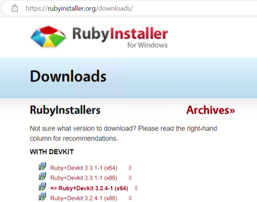
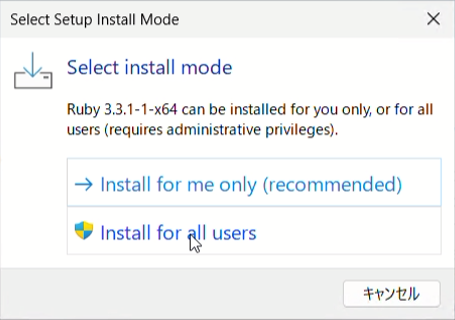
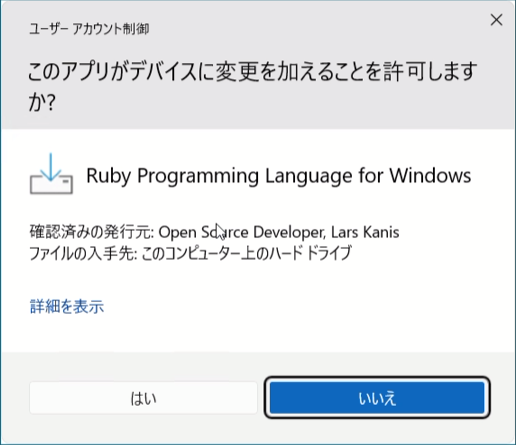
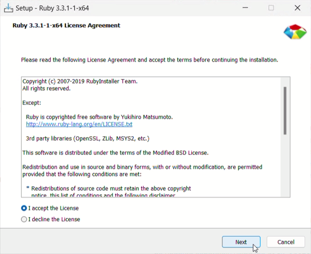
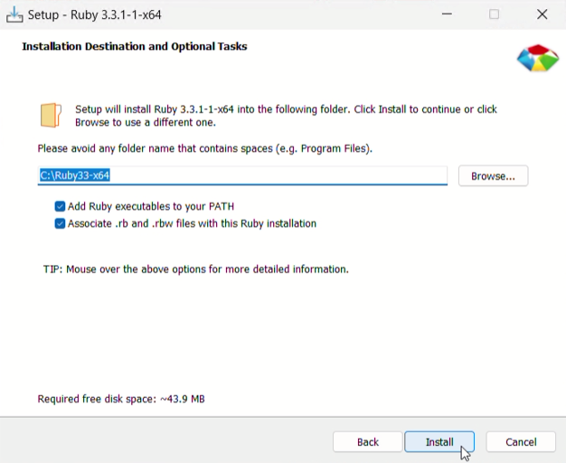
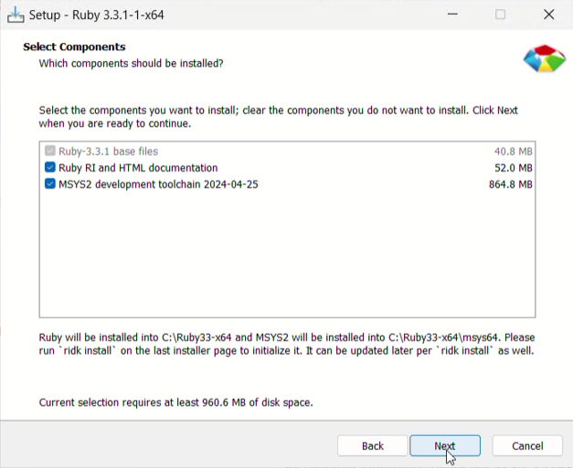
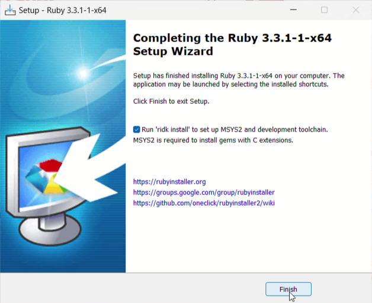
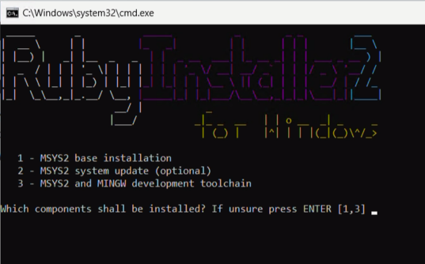

# 2. Rubyをインストールする

Rubyで書いたプログラムを実行するためには、Rubyをコンピュータにインストールする必要があります。
ここではWindowsにRubyをインストールする方法について説明します。

## RubyInstallerをダウンロードする

WindowsにRubyをインストールする場合、RubyInstallerを使うのが便利です。

RubyInstallerのサイト(https://rubyinstaller.org)を開き、「Download」ボタンをクリックしてダウンロードページに進みます。

ページ左側のWITH DEVKITの中から、最新のバージョンのリンクをクリックしてダウンロードします。

## RubyInstallerを実行する

ダウンロードしたインストーラーを実行して、次のようにインストールを進めます。

「Select install mode」という画面が表示されますので、ここでは「Install for all users」をクリックします。

「このアプリがデバイスに変更を加えることを許可しますか?」で「はい」をクリックします。

インストーラーが起動すると、「License Agreement」(ライセンス契約)が表示されます。ライセンス契約は、ソフトウェアを使うための条件の契約です。Rubyは、RubyライセンスとBSDライセンスのいずれかの条件で使うことができます。Rubyライセンスについて大まかにまとめると、以下のようになります。

1. Rubyのコードを利用する際は、ライセンスの条項にしたがう必要があります。
2. Rubyのコードは商用利用や個人利用、修正、再配布が可能ですが、条件としてライセンスの全文を含めなくてはなりません。
3. このライセンスは無保証で提供され、Rubyの使用に関連して生じたいかなる損害に対しても、開発者は責任を負いません。
4. Rubyの派生物には、オリジナルのライセンスを維持しなければなりません。

そのような条件があるということを認識したうえで、「I accept the License」を選択して「Next」ボタンをクリックします。

Installation Destination(インストール先の入力)は、特に指定したいインストール先が無ければ、そのまま「Next」をクリックします。

Select Components(コンポーネントの選択)は、すべてチェックがついた状態で「Next」をクリックします。

ここでファイルのコピーなどが行われ、完了すると「Completing the Ruby ...」が表示されますので、「Run 'ridk install' ...」のチェックが入った状態で「Finish」をクリックします。

「Ruby Installer 2」の画面が表示されます。ここではMSYS2のインストールを行います。1, Enter, 2, Enter, 3, Enter と順に実行します。

コマンドプロンプトを開き、 `ruby -v` を実行してバージョンが表示されれば正常にインストールされています。
