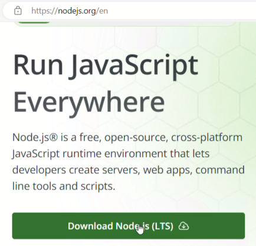

# 3. Node.jsとTypeScriptをインストールする

本書では後からTypeScriptも使っていきます。TypeScriptの紹介は後の章でしますが、準備だけここで進めておきます。    
TypeScriptで書いたプログラムを実行するためには、Rubyと同様に、TypeScriptをインストールする必要があります。TypeScriptは、Javascriptに型チェックなどの機能を付加した言語なので、Javascriptをブラウザではなくコンピューター上で実行するためのNode.jsからインストールします。

## Node.jsをダウンロードする

Node.jsのサイト(https://nodejs.org)を開くと、「Download Node.js (LTS)」というボタンがありますので、クリックしてダウンロードします。



## Node.jsをインストールする

ダウンロードしたインストーラーを実行して、次のようにインストールを進めます。

「Welcome ...」では、そのまま「Next」をクリックします。


「End-User License Agreement」(ライセンス契約)の画面が表示されます。Node.jsはMITライセンスですので、大まかにまとめると以下のような内容です。

1. このソフトウェアを誰でも無償で無制限に扱って良い。ただし、著作権表示および本許諾表示をソフトウェアのすべての複製または重要な部分に記載しなければならない。
2. 作者または著作権者は、ソフトウェアに関してなんら責任を負わない。

「I accept ...」にチェックを入れて、「Next」をクリックします。


「Destination Folder」（インストール先フォルダ）が表示されますので、特に指定したいインストール先が無ければ、そのまま「Next」をクリックします。


「Custom Setup」は通常変更不要です。そのまま「Next」をクリックします。


「Tools for Native Modules」は、Node.jsをメインで使っていく場合には「Automatically install the necessary tools ...」にチェックを入れますが、ここではチェックを入れずに「Next」をクリックします。


「Ready to install ...」が表示されますので、「Install」をクリックします。


「このアプリがデバイスに変更を加えることを許可しますか?」で「はい」をクリックします。


ここでファイルのコピーなどが行われ、完了すると「Completed ...」が表示されますので、「Finish」をクリックします。


コマンドプロンプトを開き、 `node -v` を実行してバージョンが表示されれば正常にインストールされています。

## TypeScriptをインストールする

TypeScriptはNode.jsの追加パッケージとして提供されています。そこでコマンドプロンプトから以下のコマンドを実行することで、Node.jsのパッケージとしてTypeScriptをインストールします。

```
npm install -g typescript
```

コマンドプロンプトで `tsc -v` を実行してバージョンが表示されれば正常にインストールされています。
