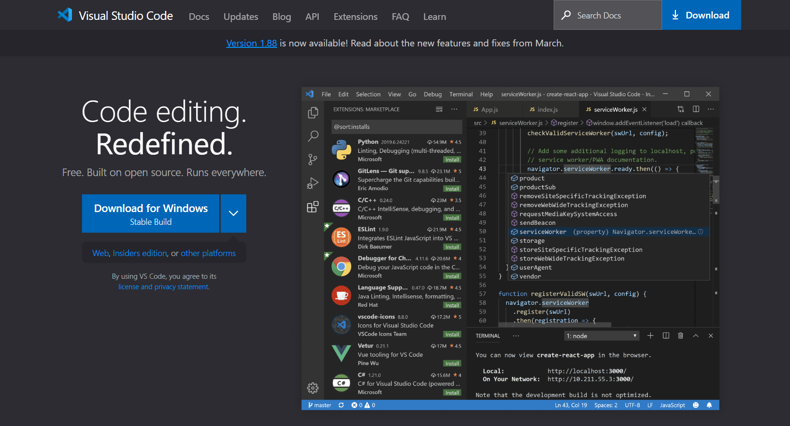
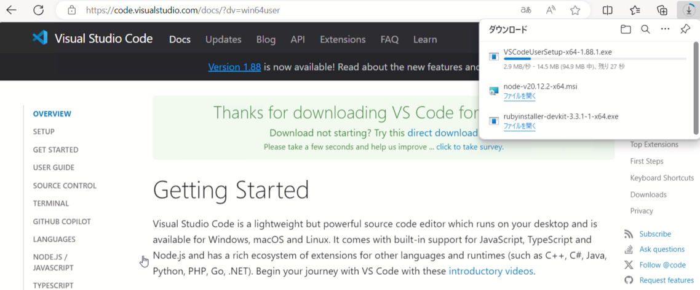
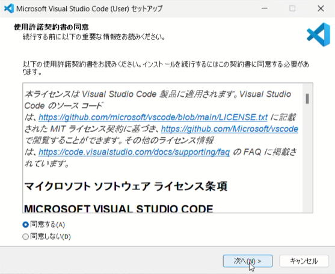
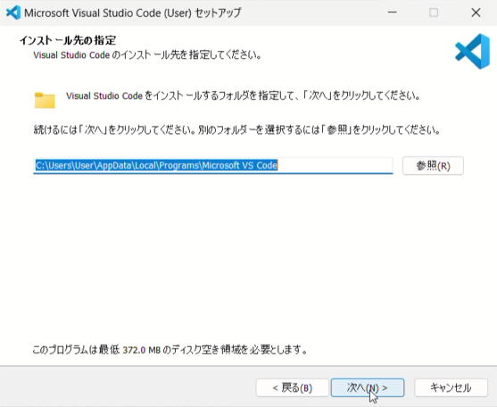
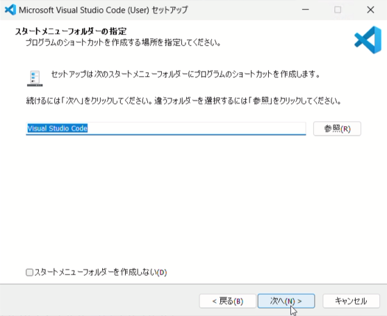
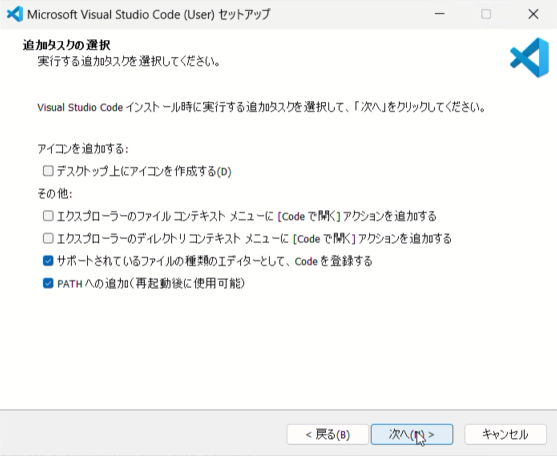
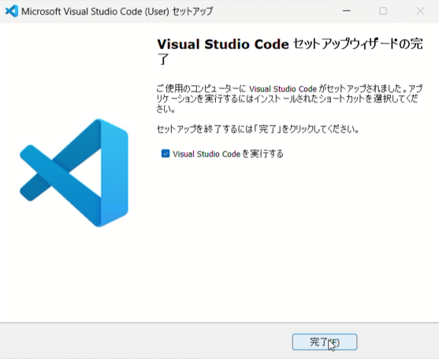
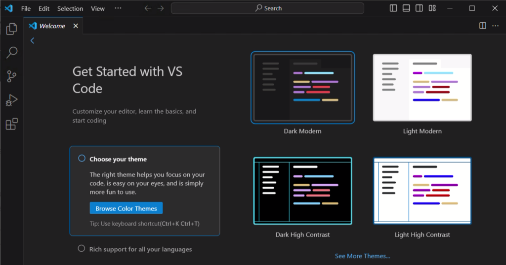
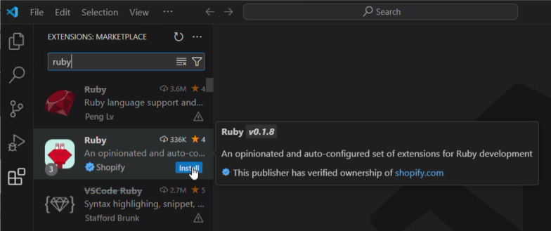

# 4. VSCodeと拡張をインストールする

プログラムを書くとき、テキストエディタや統合開発環境(IDE)と言われるソフトウェアを使います。本書ではテキストエディタの1つのVSCodeを使っていきます。

## VSCodeとは

Visual Studio Code(VSCode)はMicrosoft社が提供する無償のテキストエディタで、非常に多くの開発者に使われています。Windowsに付属のメモ帳もテキストエディタですが、プログラムを書く時の見やすさや書きやすさを考えると、やはりVSCodeが便利です。また、VSCodeには多数の拡張機能があり、これらを使うことでIDEとの境目がわからなくなるほど高機能になります。

## VSCodeをダウンロードする

VSCodeのサイト(https://code.visualstudio.com/)を開くと、WindowsのPCで開いた場合「Download for WIndows」というボタンが表示されます。そのボタンをクリックします。

ページが切り替わって、ダウンロードが行われます。

## VSCodeをインストールする

ダウンロードしたインストーラーを実行して、次のようにインストールを進めます。

最初に「使用許諾契約書の同意」の画面が表示されます。VSCodeはNode.jsと同じMITライセンスです。
内容を確認したうえで「同意する」にチェックを入れて、「次へ」をクリックします。

「インストール先の指定」では、この手順ではユーザーごとにVSCodeをインストールするようになるので、特に変更せずに「次へ」をクリックします。

「スタートメニューフォルダーの指定」は、ここも特に変更は必要ありませんので、そのまま「次へ」をクリックします。

「追加タスクの選択」では、好みに応じて各項目にチェックを入れて「次へ」をクリックします。    
初期状態でチェックが入っていない3項目は、それぞれ以下のような内容です。
* デスクトップ上にアイコンを作成する    
デスクトップにVSCodeのアイコンが作成されます。
* エクスプローラーのファイルコンテキストメニューに[Codeで開く]アクションを追加する    
エクスプローラーでファイルを右クリックしたときに、[Codeで開く]というメニューが表示され、ファイルの中身をVSCodeで表示できるようになります。
* エクスプローラーのファイルコンテキストメニューに[Codeで開く]アクションを追加する    
エクスプローラーでフォルダを右クリックしたときに、[Codeで開く]というメニューが表示され、フォルダをVSCodeで開くことができるようになります。

ここでファイルの展開などが行われ、完了すると「セットアップウィザードの完了」が表示されます。「Visual Studio Codeを実行する」にチェックを入れたまま「完了」をクリックします。

## 拡張機能をインストールする

VSCodeは拡張機能をインストールすることで、見た目をカスタマイズしたり、機能を追加したりすることができます。ここではいくつかの拡張機能を紹介します。その他にも検索して良さそうなものがあればどんどん取り入れて行ってください。

### 配色のテーマ

はじめてVSCodeを起動した際に、「Choose your theme」(テーマの選択)が表示されます。好みのテーマを選択して、「Welcome」のタブを閉じます。    
ここでの選択を変更する場合は、メニューバーの ファイル → ユーザー設定 → テーマ → 配色テーマ でテーマ名が表示されますので、変更することができます。

### Rubyの拡張機能

画面左にあるボタンの、上から5つ目にある四角を組み合わせた、拡張機能のボタンをクリックします。    
ここでRubyの拡張機能をインストールしようと思います。検索のテキストボックスに「ruby」と入力して、「Ruby (Shopify) 」の「Install」をクリックしてインストールしましょう。

### 日本語化

VSCodeは、インストールしたそのままの状態では英語での表示になっています。英語のままで平気な人は、そのまま使うのが良いと思いますが、日本語表示にしたい場合は、Rubyの拡張機能と同様に、検索のテキストボックスに「japanese」と入力して、「Japanese Language Pack for Visual Studio Code」の「Install」をクリックしてインストールします。    
インストールされると、画面右下に「Would you like to restart ...」というダイアログが表示されますので、「Yes」をクリックします。
