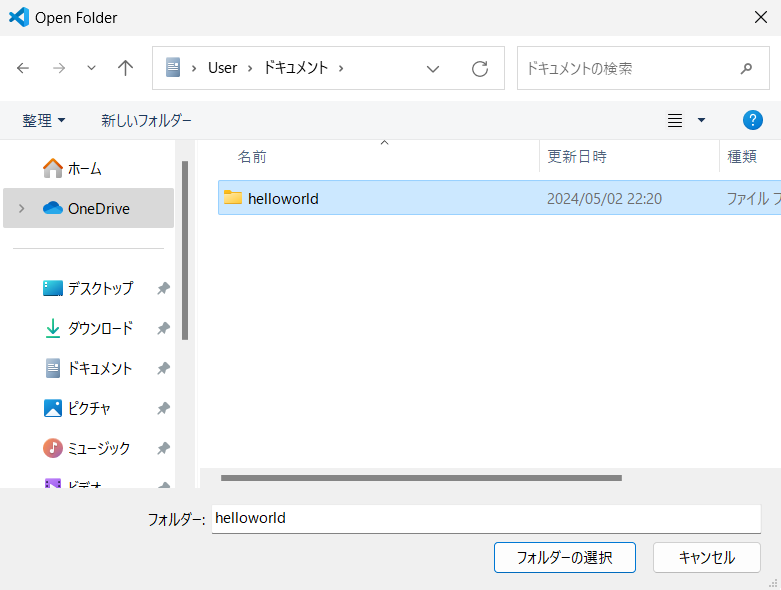

# 5. RubyプログラムをVSCodeで実行する

ここまでの手順で、Rubyのプログラムを書いて実行できる環境が整いましたので、さっそくプログラムを書いて動かしてみましょう。

## フォルダを作成して開く

プログラムを書き始めるとき、まずフォルダを作ります。ここではよくある「helloworld」を作るためのフォルダを作りましょう。

VSCodeのメニューバーから、 File - Open Folder をクリックします。

Open Folder ダイアログが開きますので、フォルダを作りたいフォルダ(後の手順では「ドキュメント」フォルダ)を開いて「新しいフォルダー」(OSが英語の場合 New Folder) をクリックします。

新しいフォルダーが表示されますので、好きな名前(ここでは helloworld)を入力して、「フォルダーの選択」をクリックします。

VSCodeで初めてフォルダーを作った場合、「Do you trust ...」というダイアログが表示されます。今後もこのフォルダー(ここではドキュメントフォルダー)でプログラムを作ると思うので、「Trust the authors of all files in the parent  folder 'Documents'」にチェックを入れて、「Yes, I trust the authors」をクリックします。

## Rubyプログラムを作成する

まずプログラムを書くファイルを作成します。画面の左上部分にあるファイルのボタンをクリックします。

ファイルが作成されますので、名前を付けます。ここではhelloworld.rbとしています。

ファイルに1行だけですが `puts "Hello world."` と入力して保存します。保存は、キーボードで [Ctrl] + [s] を押すことで保存ですることができます。こういった操作をショートカットキーと言います。プログラムを書くときは、キーボードに手を置いたまま操作できるこういった機能が便利です。

## Rubyプログラムを実行する

作成したRubyプログラムを実行します。実行にあたって、ここではVSCodeのメニューバーの Terminal - New Terminal をクリックします。すると端末 (Windowsの場合PowerShellの端末) が開きます。

端末で、 `ruby helloworld.rb` として、先ほど作ったファイルをRubyで実行します。(フレームワークを使った本格的な開発では、デバッガーを使った別の方法で起動します)

## TypeScriptプログラムを作成して実行する

TypeScriptの環境も作りましたので、Rubyで実行し多様な手順でTypeScriptのプログラムも実行できます。

ファイル作成のボタンをクリックして、ここではファイル名を「helloworld.ts」とします。

ファイルに1行だけ `console.log("Hello world.");` と入力して保存します。ちなみに、この1行の記述は Javascript とまったく同じ内容です。

TypeScriptでは、Rubyのようにそのまま実行するのではなく、コンパイルして実行します。C言語では機械語に、JavaではJava仮想マシンの機械語に相当する中間言語に変換(翻訳)して、コンピュータや仮想マシンで実行します。

TypeScriptではJavascriptにコンパイルして実行します。そのコンパイルプログラムである `tsc` は、Rubyの時に開いた PowerShell では実行できない(エラーになる)ようになっています。    
そのため、「＋」ボタンから「Command Prompt」を開きます。これはWindowsのコマンドプロンプトと、内部的には同じです。

コマンドプロンプトで、 `tsc` によるコンパイルを実行した後、生成された　Javascript のファイルを、node で実行します。

